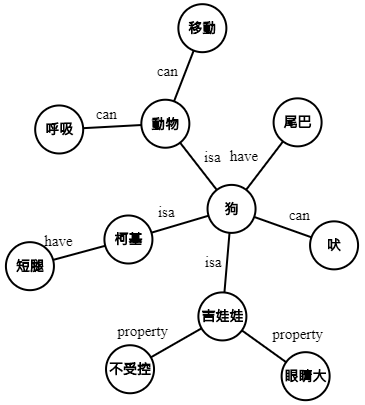

[![CC BY-SA 4.0][cc-by-sa-shield]][cc-by-sa]

# Overview

  

This dataset is a refined and expanded version of Chinese ConceptNet.  
(the original ConceptNet dataset is in [commonsense/conceptnet5](https://github.com/commonsense/conceptnet5/wiki))

ConceptNet collected commonsense knowledge from voluntary web users all around the world by crowdsourcing.  
It contains a variety of domains in real-world and can be applied in different tasks, such as analogy, commonsense reasoning and natural language understanding. 

Knowledge acquired by crowds tend to be noisy, redundancy and meaningless especially for unguided projects without supervision and voluntary participants.
Therefore, we refined ConceptNet to reduce its error rate.  
In the mean time, we increased the quality of ConceptNet. The quality here refers to correctness, coverage and number of concepts.  

Please check the [reports](https://github.com/play0137/Chinese_ConceptNet/tree/master/reports) for more information.

### Assertion examples
ID    |Start|End|Relation       |SurfaceText              |Weight  
:----:|:---:|:-:|:-------------:|:-----------------------:|:----:
438595|水銀 |有毒|HasProperty    |[[水銀]] 是 [[有毒]] 的。 |1.0  
183195|上課 |睏  |Causes         |[[上課]] 會令人 [[睏]]。  |1.0
241669|魚   |游泳|CapableOf      |[[魚]] 會 [[游泳]]。      |1.0
154481|出門 |上學|MotivatedByGoal|[[出門]] 是為了 [[上學]]。|1.0

# References

If you use this version of Chinese ConceptNet in your works, please cite this paper:
> Ying-Ren Chen (2021). [Generate coherent text using semantic embedding, common sense templates and Monte-Carlo tree search methods](https://etd.lib.nctu.edu.tw/cgi-bin/gs32/hugsweb.cgi?o=dnthucdr&s=id=%22G021040625840%22.&searchmode=basic) (Master's thesis, National Tsing Hua University, Hsinchu, Taiwan).  

BibTeX:  
> @mastersthesis{Chen:2021:generate_coherent_text,  
&nbsp;&nbsp;&nbsp;&nbsp; author = "Ying-Ren Chen,  
&nbsp;&nbsp;&nbsp;&nbsp; title = "Generate coherent text using semantic embedding, common sense templates and Monte-Carlo tree search methods",  
&nbsp;&nbsp;&nbsp;&nbsp; school = "National Tsing Hua University",  
&nbsp;&nbsp;&nbsp;&nbsp; pages = 136,  
&nbsp;&nbsp;&nbsp;&nbsp; year = 2021  
}  

The data cleaning part of Chinese ConceptNet is in Chapter 3.1, 4.1 and Appendix A, B  

And this paper:
> Robyn Speer, Joshua Chin, and Catherine Havasi. 2017. "ConceptNet 5.5: An Open Multilingual Graph of General Knowledge." In proceedings of AAAI 31.

# License

This work is licensed under a
[Creative Commons Attribution-ShareAlike 4.0 International License][cc-by-sa].  
[![CC BY-SA 4.0][cc-by-sa-image]][cc-by-sa]

[cc-by-sa]: http://creativecommons.org/licenses/by-sa/4.0/
[cc-by-sa-image]: https://licensebuttons.net/l/by-sa/4.0/88x31.png
[cc-by-sa-shield]: https://img.shields.io/badge/License-CC%20BY--SA%204.0-lightgrey.svg
