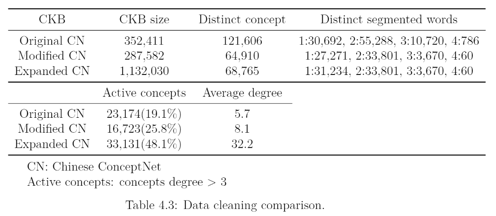

### Brief explanations to reports
- data_cleaning: why and how we have to modify the data
- data_cleaning_relations: modifications of each relation
- relations_detailed_information: describe the concept types in 'Start' and 'End' field and their corresponding 'SurfaceText'
- relations_explanations_and_examples: explain the meaning of each relation and give an simple example  
- The number of assertions in ConceptNet.csv and ConceptNet_expansion.csv are 292,894 and 1,136,673

---

  

Although the coverage of original ConceptNet is wider than the modified one, it contains numerous errors.  
We refine the data, expand by different kinds of relations (mainly “Synonym”) and ensure the quality of ConceptNet.  
Expanded ConceptNet is 3.21 times of the size of the original one.  
The actual number of each statistic in original ConceptNet should be smaller, because numerous incorrect concepts are included.  

In order to translate concept to machine-readable representation, word embedding is needed.  
Average word embeddings of segmented words can’t fully represent or even differ from original meaning, especially when the concept contains ambiguous segmented words or the concept is a term that can’t be separated.  

Take [賞 巴掌] (slap someone’s face) as an example (blank between two words means they are segmented).  
“賞” means rewarding somebody for something, appreciating or admiring something.  
“賞” in [賞 巴掌] means giving something to someone.  
Word with ambiguities is hard to tell which one will be used in word embedding.  
Paraphrase [賞 巴掌] to its similar concept [打耳光] to disambiguate.  

We decrease the number of multiple segmented ( > 1) concepts up to 44%.  
Therefore, the words can be represented more precisely.
